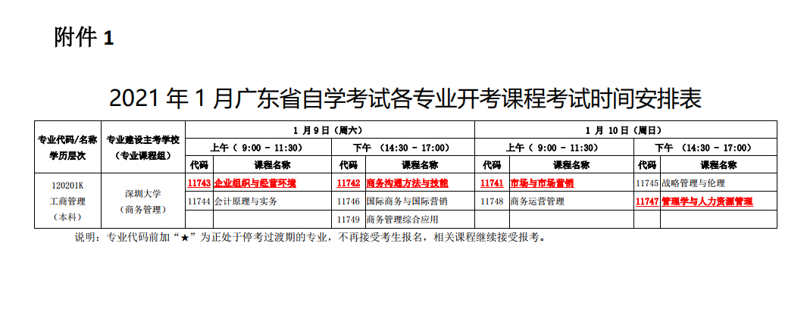
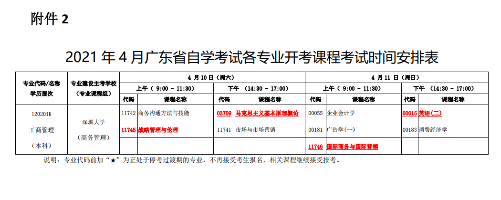
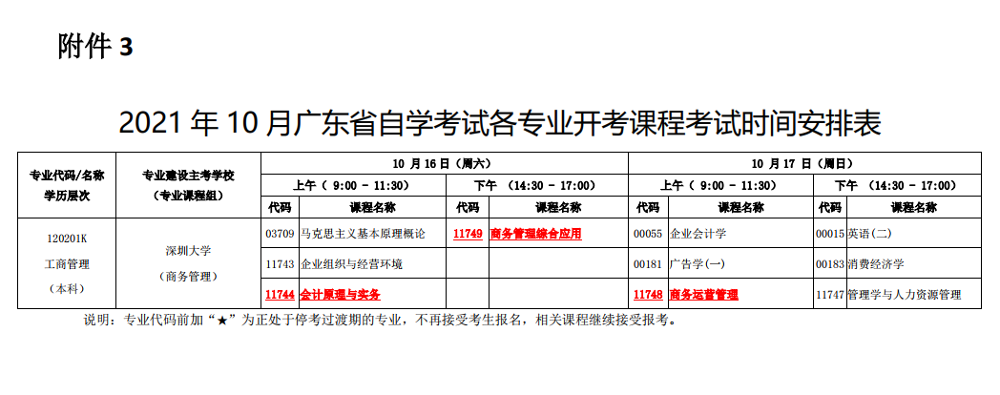

# 2021年广东省自学考试开考课程考试时间安排


> **关于公布2021年广东省自学考试开考课程考试时间安排的通知**
>
> 地址：http://eea.gd.gov.cn/zxks/content/post_3095339.html


重要附件：

| 附件 | 附件名称                                               |
| ---- | ------------------------------------------------------ |
| 1    | 1.2021年1月广东省自学考试各专业开考课程考试时间安排表  |
| 2    | 2.2021年4月广东省自学考试各专业开考课程考试时间安排表  |
| 3    | 3.2021年10月广东省自学考试各专业开考课程考试时间安排表 |
| 4    | 4.2021年广东省自学考试开考课程使用教材表               |


整理的考试信息

```
    2021年我省自学考试开考3次，分别为1月9、10日；4月10、11日；10月16、17日。各专业开考课程具体时间安排详见附件1、2、3。
```








